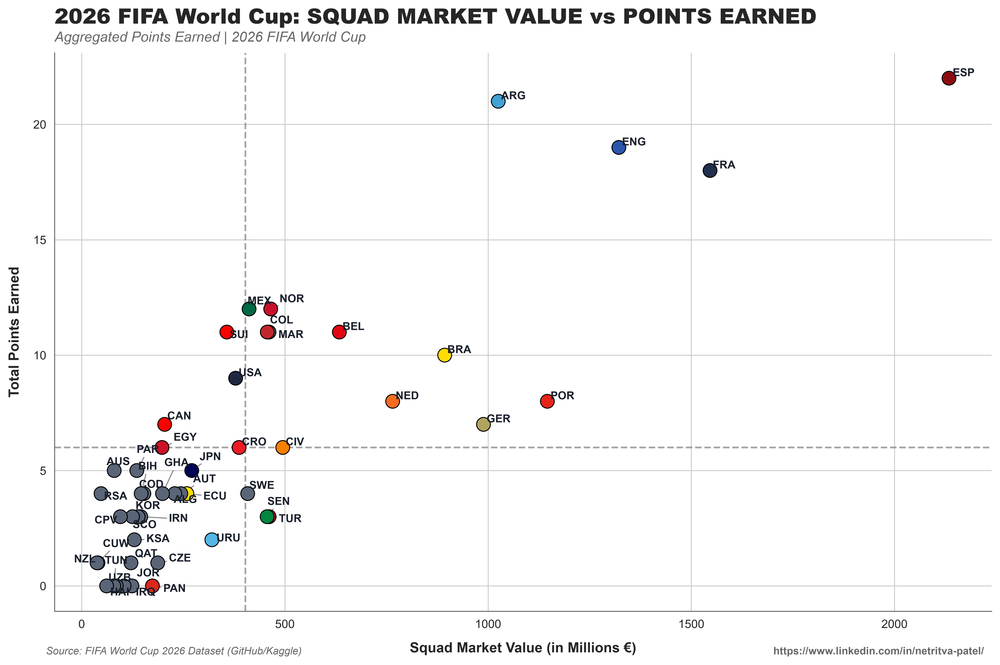

# 💶 2026 FIFA World Cup: Squad Market Value vs. Points Performance

A data-driven recruitment and sports economics study mapping total squad valuation against total points earned across the 2026 FIFA World Cup.

---

## 📌 Executive Summary

In modern football analytics, evaluating **financial efficiency**—how effectively squad market value converts into on-pitch points—is essential for recruitment departments and technical directors. 

This project benchmarks national team financial valuations (in Millions €) against their accumulated points in the 2026 FIFA World Cup, categorizing teams into four distinct operational quadrants: **Overperformers**, **Elite High-Value Powers**, **Underperforming Financial Giants**, and **Value Baseline Squads**.

---

## 🔑 Key Analytical & Financial Insights

### 1. The High-Value Upper Tier (Dominant Financial Conversion)
* **Spain (ESP):** Highest squad market value (>€2,000M) and the tournament's highest total points earned (22 points), setting the gold standard for high-investment conversion.
* **Argentina (ARG), England (ENG), & France (FRA):** Placed firmly in the elite top-right quadrant. **Argentina** stands out for maximum valuation efficiency, accumulating 21 points at a lower squad valuation (~€1,000M) compared to England and France (~€1,300M–€1,550M).

### 2. Market Inefficiencies & Major Overperformers
* **Mexico (MEX), Norway (NOR), Colombia (COL), & Morocco (MAR):** Identified as the tournament's most efficient **"Budget Overperformers."** Despite maintaining squad values well below the €500M baseline, each accumulated 11–12 points, severely outperforming their expected financial yield.
* **Switzerland (SUI):** Generated 11 points on a ~€300M valuation, demonstrating exceptional structural efficiency against higher-budget nations.

### 3. Financial Underperformance & Capital Inefficiency
* **Portugal (POR), Germany (GER), & Brazil (BRA):** Marked as notable **"Capital Underperformers."** Despite boasting squad valuations between €800M and €1,200M, they failed to cross the 10-point mark, indicating low return on squad valuation.
* **Uruguay (URU) & Turkey (TUR):** Accumulated fewer points than expected given their mid-tier financial valuation (~€400M–€500M), falling below the average tournament point threshold.

---

## 📊 Visualizations

### Squad Market Value vs. Points Earned Matrix
*Scatter plot breakdown evaluating market value efficiency across all participating nations.*



---

## 📁 Repository Structure

```text
.
├── Market_Value_vs_Performance/
│   ├── Squad_market_and_performance.ipynb  # Notebook: Data cleaning, valuation processing, & plotting
│   └── market_value_vs_points.png          # Visual chart export: Market Value vs Points
│
├── .gitignore                              # Git ignore file for Python environments
├── LICENSE                                 # MIT License
└── README.md                               # Project documentation
